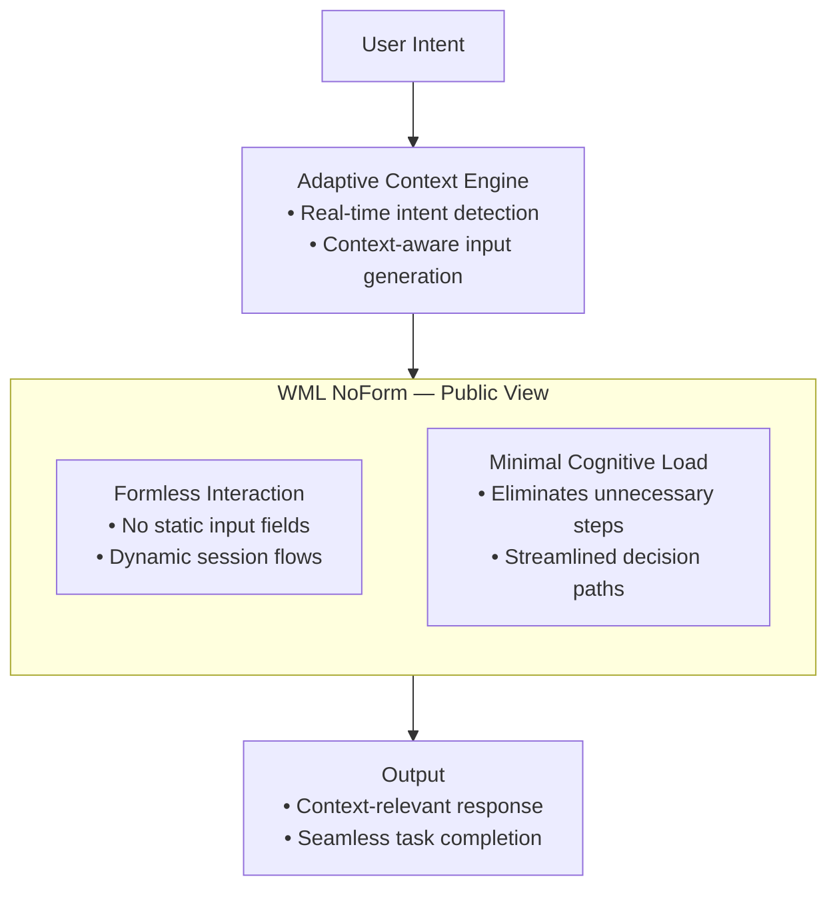

# WML NoForm — Public Concept

## Overview
**WML NoForm** is a user interface paradigm that removes all traditional form fields, replacing them with adaptive, context-aware input flows.  
It is designed to minimize user friction, streamline interactions, and adapt to user intent in real time.  
This repository contains a simplified, non-sensitive version for demonstration purposes.

---

## Core Idea
- **Formless Interaction** — No static input fields; the system dynamically adjusts to the user's current intent.
- **Adaptive Context Engine** — Detects real-time intent and generates context-relevant inputs.
- **Minimal Cognitive Load** — Reduces friction by removing unnecessary steps and streamlining decisions.

---

## Applications
- Conversational AI Interfaces
- Seamless Onboarding Experiences
- Zero-Friction Transactions
- Context-Adaptive Virtual Assistants

---

## Example Use Cases
1. **Customer Support Chatbot**
   - Dynamically asks relevant follow-up questions based on user responses without predefined forms.
2. **E-commerce Checkout**
   - Removes all static forms; system detects shipping/payment details contextually during conversation.
3. **Onboarding for SaaS**
   - Guides new users interactively, requesting only what’s needed at each stage.

## License
MIT License — safe for public sharing.

## Documentation
- [Overview](docs/overview.md)
- [Use Cases](docs/use-cases.md)
- [FAQ](docs/faq.md)
- [Access & NDA Policy](docs/access.md)

## Visual Framework

*"Interfaces should adapt to the user — not the other way around."*

