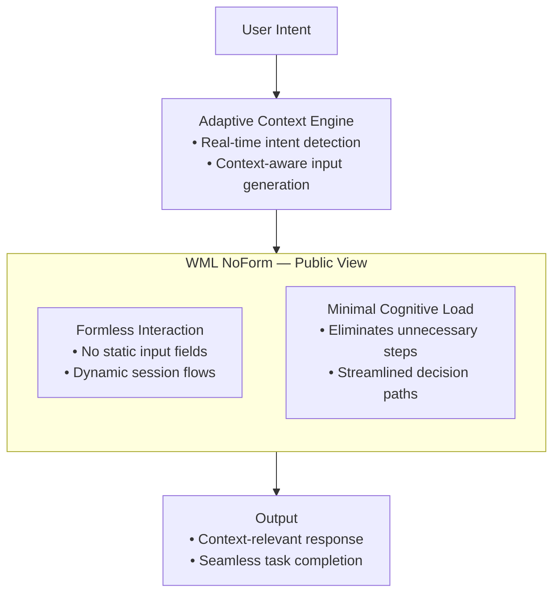

# WML-NoForm-Public
# WML NoForm — Public Concept

## Overview
WML NoForm is a user interface paradigm that removes all traditional form fields, replacing them with adaptive, context-aware input flows.
This public repository contains a simplified, non-sensitive version of the concept for demonstration purposes.

## Core Idea
- **Formless Interaction:** No static input fields — system adapts to user’s intent in real-time.
- **Adaptive Context Engine:** Analyzes session context to decide what input is required and when.
- **Minimal Cognitive Load:** Reduces user friction by eliminating unnecessary steps.

## Applications
- Conversational AI interfaces
- Streamlined onboarding flows
- Zero-friction transaction systems

## License
MIT License — safe for public sharing.

## Documentation
- [Overview](docs/overview.md)
- [Use Cases](docs/use-cases.md)
- [FAQ](docs/faq.md)
- [Access & NDA Policy](docs/access.md)

## Visual Framework

*"Interfaces should adapt to the user — not the other way around."*

